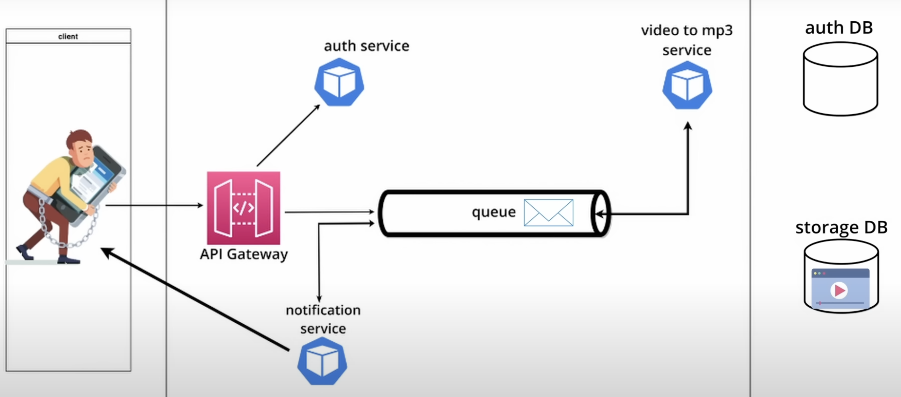
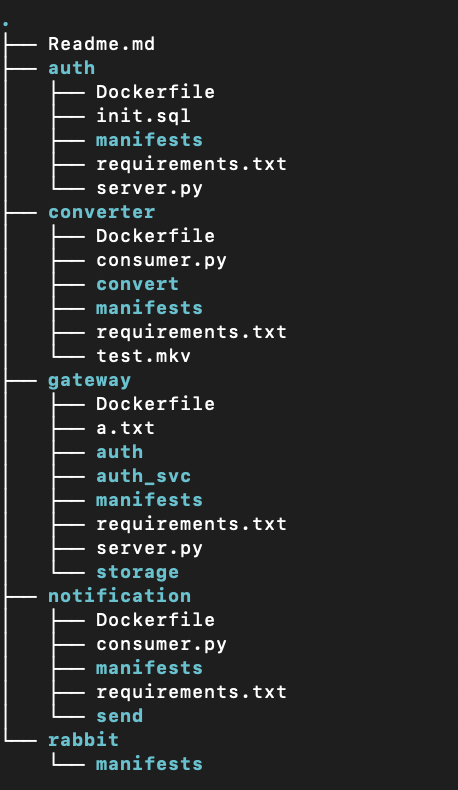
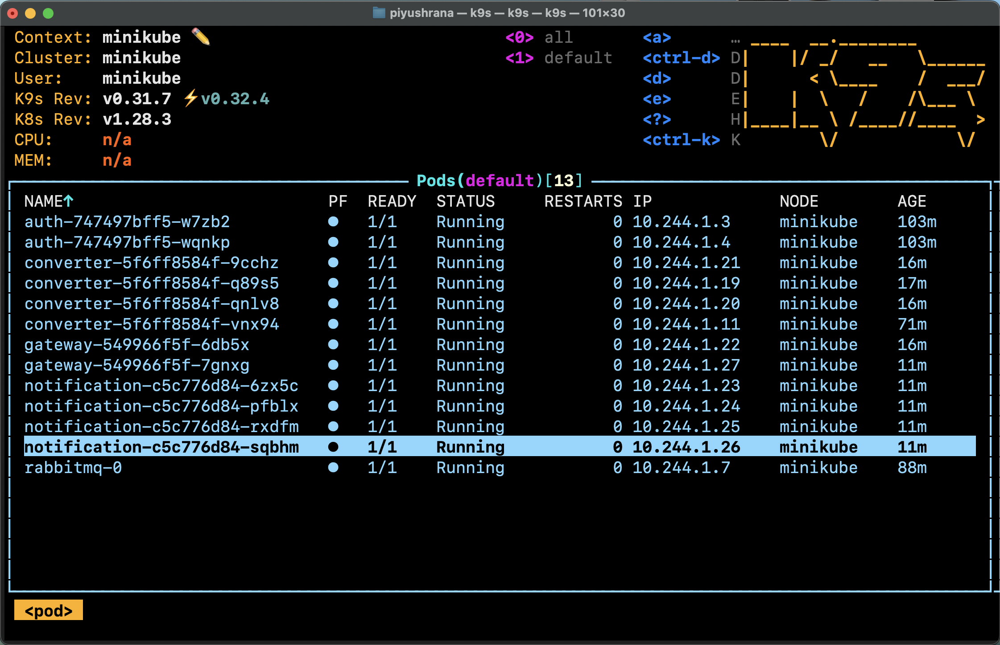
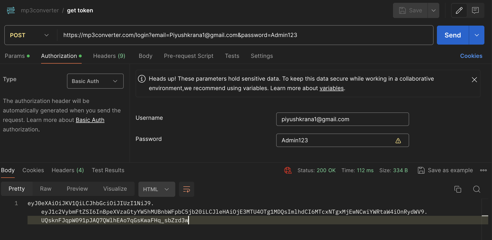
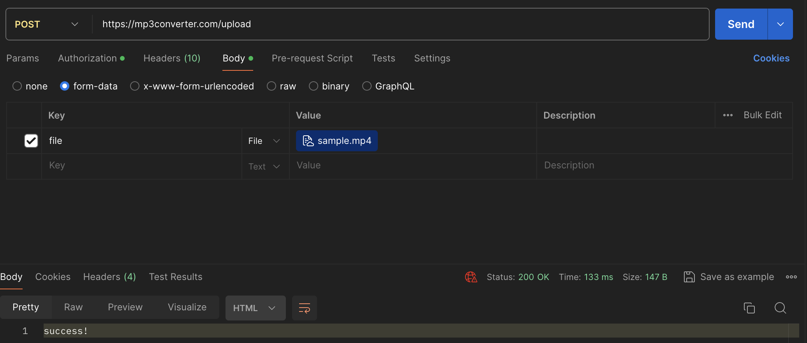
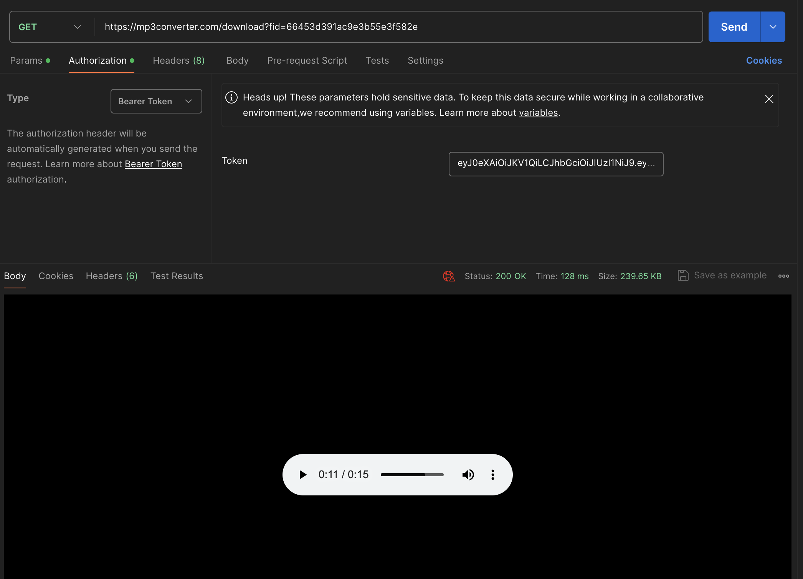

## Architecture Overview

The project architecture follows a microservices approach, utilizing Kubernetes for container orchestration and RabbitMQ for message queuing. Below is an overview of the architecture:

### Components:

1. **Gateway Service**
2. **Authentication Microservice**
3. **Converter Microservice**
4. **Notification Microservice**
5. **RabbitMQ**
6. **MongoDB**
7. **Kubernetes Cluster**

### Architecture Diagram:

Include your architecture diagram here.

## Project Description

This project utilizes a single-node Minikube cluster with Kubernetes and RabbitMQ to convert videos to MP3 format. The microservices architecture is employed, with each microservice deployed in Kubernetes using Docker containers and RabbitMQ for communication.

MongoDB GridFS is utilized to store the files, while MySQL database is used for authentication purposes.
This repository contains the following files and directories:

This project implements a video-to-MP3 conversion service using a microservices architecture deployed on a single-node Minikube cluster with Kubernetes. The flow of the project is as follows:

1. **User Interaction**: 
   - Users interact with the gateway service to log in and upload videos.

2. **Authentication and Validation**:
   - Upon uploading a video, the gateway service internally interacts with the authentication microservice to validate the user's credentials.
   - If authentication is successful, the video is queued for processing.

3. **Video Processing**:
   - The gateway service places the uploaded video into a video processing queue.
   - The converter service consumes videos from the queue, converts them to MP3 format, and stores the resulting MP3 files in MongoDB.
   - Each MP3 file is assigned a unique identifier.

4. **Notification**:
   - The notification service monitors the MP3 queue for completed conversions.
   - Once an MP3 file is ready, the notification service informs the user that their download is available.

5. **Download**:
   - Users can then download the converted MP3 file by hitting the `/download?fid="id"` endpoint provided by the notification service, where `"id"` is the unique identifier assigned to the MP3 file.

## Directory Tree

## Kubernetes Cluster Status (K9s)
### K9s Running Locally

## Postman API Call
### Step 1: Get Token

### Step 2: Upload Video

### Step 3: Download MP3
